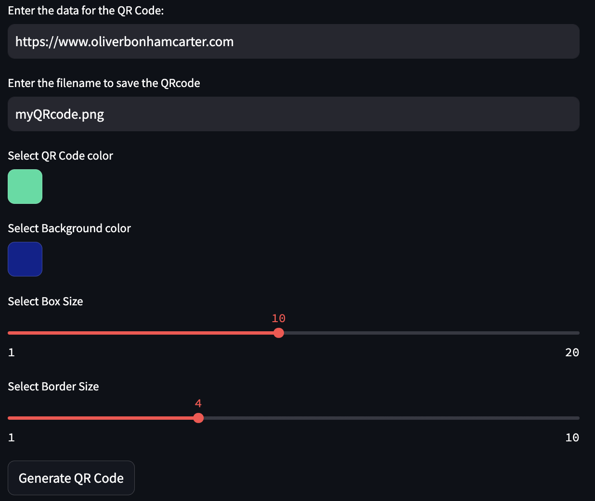

# MyQR: An Interactive QR code Generator

- Oliver Bonham-Carter, [Web](https://www.oliverbonhamcarter.com/)
- email: obonhamcarter@allegheny.edu
- Date: 7th December 2024

---


---

## Table of contents
- [MyQR: An Interactive QR code Generator](#myqr-an-interactive-qr-code-generator)
  - [Table of contents](#table-of-contents)
    - [Command Summary](#command-summary)
    - [Creating QRcodes With Browser Tool](#creating-qrcodes-with-browser-tool)
  - [A work in progress](#a-work-in-progress)

### Command Summary

* The whole project was written in poetry and uses the [Streamlit](https://docs.streamlit.io/) and the [qrcode](https://pypi.org/project/qrcode/) library. [Poetry](https://python-poetry.org/docs/) manages these libraries for you so that you never have to think about them!
* To engage poetry initially, use the following command from the root of the project. Note: the *root of the project* is the directory where the file, `pyproject.toml` resides.

`poetry install`

Below are commands to run BeagleTM2 using a Docker container which houses all necessary libraries and software for BeagleTM.

- Basic help to run the project

``` bash
poetry run myqr --help
```
- Involved help to run the project

``` bash
poetry run myqr --bighelp
```

- Actual command to engage the program

``` bash
poetry run myqr --client qr
```

### Creating QRcodes With Browser Tool



- Enter the text to encode in a QR code
- Pick your colours
- Select size and boarder width of the qr `.png` file
- Select the `Generate QR Code` button.
- View the QRcode as a `.png` image that will appear.
- Check the output directory: `0_out/` for your `.png` file, or save it by right-clicking on the image itself.

## A work in progress

Check back often to see the evolution of the project!! If you would like to contribute to this project, __then please do!__ For instance, if you see some low-hanging fruit or task that you could easily complete, that could add value to the project, then I would love to have your insight.

Otherwise, please create an Issue for bugs or errors. Since I am a teaching faculty member at Allegheny College, I may not have all the time necessary to quickly fix the bugs and so I would be very happy to have any help that I can get from the OpenSource community for any technological insight. Much thanks in advance. I hope that this project helps you find the knowledge from PubMed that you require for your project. :-)
